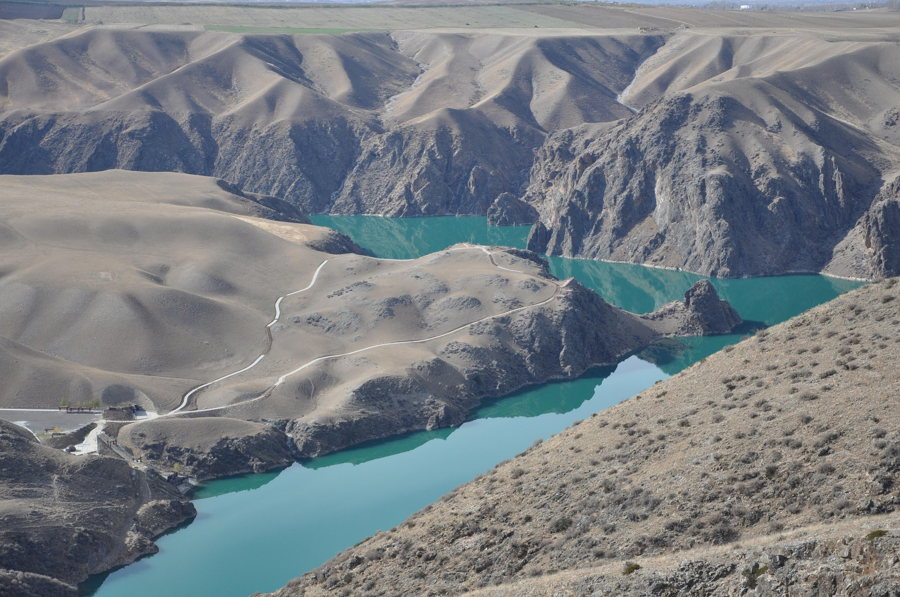

{fig-align="center" width="100%"}
*Fuente: [Pixabay - Uso libre](https://pixabay.com/es/photos/monta%C3%B1as-r%C3%ADos-verde-hermosa-4662950/)*

# Introduccción
Este proyecto analiza la evolución del caudal de las cuencas internas de Catalunya en el período 2020-2025, afectadas por un gran período de sequía. Se estudian mediante las diferentes visualizaciones, patrones espaciales y temporales.

El objetivo es identificar la intensidad, evolución temporal y distribución espacial de la sequía.

```{python}
#| echo: false
# Cargar librerías
import pandas as pd
import plotly.express as px
from pyproj import Transformer
```

```{python}
#| echo: false
# Cargar dataset
df = pd.read_csv("cabal_riu.csv")
# Cambiar tipo de dato fecha
df['Dia'] = pd.to_datetime(df['Dia'])
# Crear columna 'Mes'
df['Mes'] = df['Dia'].dt.to_period('M').dt.to_timestamp()
# Agrupar por mes y cuenca
df_mes = df.groupby(['Mes', 'Conca'])['Cabal (m3/s)'].mean().reset_index()
```

## Evolución del caudal
El gráfico muestra una reducción, en general, del caudal medio en las diferentes cuencas de los ríos de Catalunya durante el período analizado. Se observa una brusca caída del caudal hasta finales de 2020 y una recuperación significativa en cuencas como El Ter, El Llobregat o El Besòs a principios de 2025, coincidiendo con la sequía de 2021 a 2024.

```{python}
#| echo: false
# Crear gráfico de líneas
fig = px.line(
  df_mes,
  x = 'Mes',
  y = 'Cabal (m3/s)',
  color = 'Conca',
  title = '<b>Evolución temporal de las cuencas de Catalunya (2020-2025)</b>'
)

fig.update_layout(
  title_x = 0.5,
  xaxis_title = 'Fecha',
  yaxis_title = 'Caudal medio (m3/s)',
  xaxis_tickangle = -45,
  hovermode = 'x unified'
)

fig.show()

```

## Distribución espacial del caudal
Tras analizar la evolución temporal del caudal medio por cuenca, se representa la distribución espacial de los caudales medios registrados en las distintas estaciones de medición comprendidas entre 2020 y 2025 en las cuencas de los ríos de Catalunya. Se observa un caudal medio mayor registrado en la cuenca de El Ter.

```{python}
#| echo: false
# Crear mapa interactivo
# EPSG Catalunya huso 31N - https://spatialreference.org/ref/epsg/25831/
# Convertir UTM a latitud y longitud
transformer = Transformer.from_crs("EPSG:25831", "EPSG:4326", always_xy=True)
df['longitud'], df['latitud'] = transformer.transform(df['UTM X'].values, df['UTM Y'].values)

# Calcular media de caudales por estación
mitjana = df.groupby(['Conca', 'longitud', 'latitud'])['Cabal (m3/s)'].mean().reset_index()

# Construcción mapa
fig = px.scatter_geo(
  mitjana,
  lat='latitud',
  lon='longitud',
  color='Cabal (m3/s)',
  size='Cabal (m3/s)',
  scope='europe',
  hover_name='Conca'
)

fig.update_layout(
  title="<b> Mapa de distribución de caudales en Catalunya (2020-2025)</b>",
  title_x=0.5
)
fig.show()
```

## Sequía por cuenca
El mapa de calor muestra la proporción de observaciones clasificadas como caudal bajo o muy bajo para cada cuenca y año. En general se observa un aumento de sequía a partir de 2021 y una reducción para 2025.

```{python}
#| echo: false
# Crear columna 'Any'
df['Any'] = df['Dia'].dt.year
# Crear variable 'Sequera'
df['Sequera'] = df['Ràtio (categoria)'].isin(['Baix', 'Molt baix'])
# Proporción de sequía por año y cuenca
df_any = df.groupby(['Conca', 'Any'])['Sequera'].mean().unstack()

fig = px.imshow(
  df_any,
  color_continuous_scale='YlOrRd',
  title="<b>Anomalías del caudal respecto a la media por año</b>",
  aspect='auto'
)

fig.update_layout(
  title_x=0.5,
  xaxis_title='Año',
  yaxis_title='Cuenca'
)

fig.show()
```

## Conclusión
El análisis confirma una sequía entre el período 2021-2024 debido a una disminución del caudal en dicho período. El caudal varía según la zona de Catalunya, por lo que, la sequía fue más intensa en determinadas cuencas.

La combinación de los distintos análisis confirma que el fenómeno analizado se sostiene en el tiempo, pero es muy desigual entre territorios.

En conjunto, los datos muestran una sequía prolongada con impacto desigual y recuperación parcial.